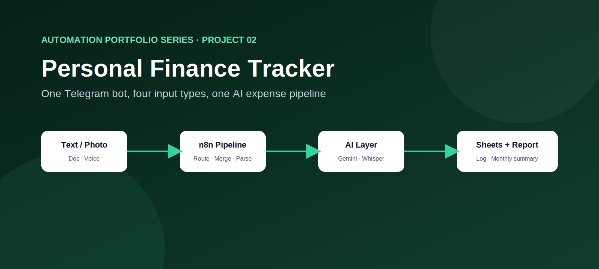
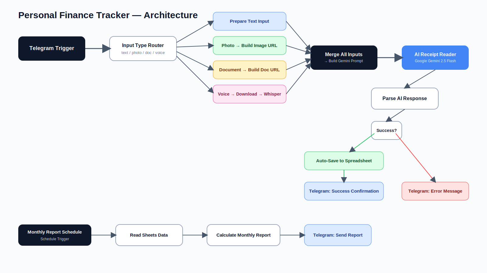

# Personal Finance Tracker Automation

### A multi-input expense tracking system built with n8n, Telegram, and Google Gemini

**Project 02 — Automation Portfolio Series**

[Business Problem](#business-problem) ·
[Solution](#solution) ·
[Architecture](#architecture) ·
[Workflow Overview](#workflow-overview) ·
[Setup](#local-setup-and-configuration) ·
[Roadmap](#roadmap)

> **Portfolio note:** This project uses a personal Telegram bot and a demonstration Google Sheet as its data layer. All tokens, spreadsheet identifiers, and personal identifiers from the original build have been removed and replaced with environment-variable placeholders before publication.

---

## Executive summary

Manually tracking daily expenses across cash, e-wallets, and multiple currencies is tedious. Most people either stop logging expenses after a few days or only reconcile spending once a month, by which point the details of individual purchases are already forgotten.

This project demonstrates a single n8n workflow that accepts an expense entry through **four different input types** — typed text, a photo of a receipt, a forwarded PDF/document, or a voice note — inside one Telegram chat, and normalises all of them into structured rows in a shared Google Sheet.

The project is designed to demonstrate:

- multi-modal input handling in a single automation (text, image, document, audio);
- AI-based receipt/document understanding using Google Gemini;
- speech-to-text transcription using Groq's hosted Whisper endpoint;
- prompt design for structured, schema-constrained JSON extraction;
- currency-aware expense normalisation (original currency + USD conversion);
- scheduled reporting back to the user;
- secure configuration using n8n credentials and environment variables;
- transparent limitations rather than overstating production readiness.

---

## Business problem

Someone tracking personal expenses day to day typically faces:

1. **Friction at the point of spending**
   Opening a spreadsheet app mid-purchase to log an expense is easy to skip.

2. **Multiple expense formats**
   A cash purchase is a short text message. A restaurant bill is a photo. A subscription invoice is a PDF. A quick note while walking is easiest to just say out loud.

3. **Multi-currency spending**
   Expenses in different currencies are hard to compare without manual conversion.

4. **No periodic review**
   Without a scheduled summary, spending patterns are only noticed after the fact — or not at all.

---

## Solution

The workflow is built around a single Telegram bot that acts as the only interface the user needs.

1. **Input Type Router** — a Telegram trigger detects whether the incoming message is text, a photo, a document, or a voice note, and routes it down the matching branch.
2. **Normalisation branches** — each input type is converted into a common intermediate shape (`chat_id`, `input_date`, `input_type`, `text_content` / `image_base64` / `base64Data`).
3. **Voice-to-Text Engine** — voice notes are downloaded from Telegram and transcribed using Groq's hosted `whisper-large-v3` model before being merged back into the text pipeline.
4. **AI Receipt Reader** — all normalised input is sent to Google Gemini (`gemini-2.5-flash`) with a schema-constrained prompt that returns structured JSON: merchant, category, item, original amount/currency, and a USD-converted amount.
5. **Parse AI Response** — the JSON response is parsed defensively, with fallback messaging if Gemini's output is malformed or the request fails.
6. **Auto-Save to Spreadsheet** — successfully parsed entries are appended to a shared Google Sheet.
7. **Telegram confirmation / error messages** — the user receives an immediate confirmation (or a clear error) directly in the same chat.
8. **Monthly Report Schedule** — a separate scheduled trigger reads the sheet on a recurring basis, calculates a monthly summary, and sends it back to the user via Telegram.

This single-workflow design was chosen because the input channel (Telegram) and review channel (Telegram + Sheets) are the same for every input type — a modular multi-workflow split (like the [Hotel AI Concierge](https://github.com/syifaannisa/hotel-ai-concierge-automation) project) was not necessary here.

---

## Architecture

See [`docs/architecture.md`](architecture.md) for the full node-by-node breakdown.

---

## Workflow overview

| Workflow file | Trigger | Responsibility |
|---|---|---|
| `personal-finance-tracker.json` | Telegram message (text/photo/document/voice) + daily/weekly schedule | Normalises any supported input type, extracts structured expense data via Gemini, saves it to Google Sheets, and sends a scheduled spending report |

---

## Local setup and configuration

Full step-by-step instructions are in [`setup-guide.md`](setup-guide.md). At a high level:

1. Import `workflows/personal-finance-tracker.json` into your own n8n instance.
2. Create a Telegram bot via [@BotFather](https://t.me/BotFather) and set `TELEGRAM_BOT_TOKEN` as an environment variable on your n8n instance (see [`.env.example`](.env.example)).
3. Re-bind the Telegram, Google Sheets, and HTTP Header/Query Auth credential nodes to your own n8n credentials — credential bindings are never included in an exported workflow.
4. Create a Google Sheet using the schema in [`google-sheets-schema.md`](google-sheets-schema.md) and set its ID via `GOOGLE_SHEET_ID` / the Google Sheets node's document picker.
5. Create a free Groq API key for Whisper transcription and a Google AI Studio key for Gemini, and attach them as generic auth credentials on the relevant HTTP Request nodes.

---

## Configuration reference

See [`configuration-reference.md`](configuration-reference.md) for every environment variable and credential the workflow expects.

---

## Data schema

See [`google-sheets-schema.md`](google-sheets-schema.md) and [`google-sheets-schema.csv`](google-sheets-schema.csv) for the expected Google Sheets columns.

---

## Security

See [`SECURITY.md`](SECURITY.md) and [`sanitisation-report.md`](dsanitisation-report.md) for what was removed from this workflow before publication, and what to check before you publish your own copy.

---

## Limitations and roadmap

See [`limitations-and-roadmap.md`](limitations-and-roadmap.md).

---

## License

Released under the [MIT License](LICENSE).
